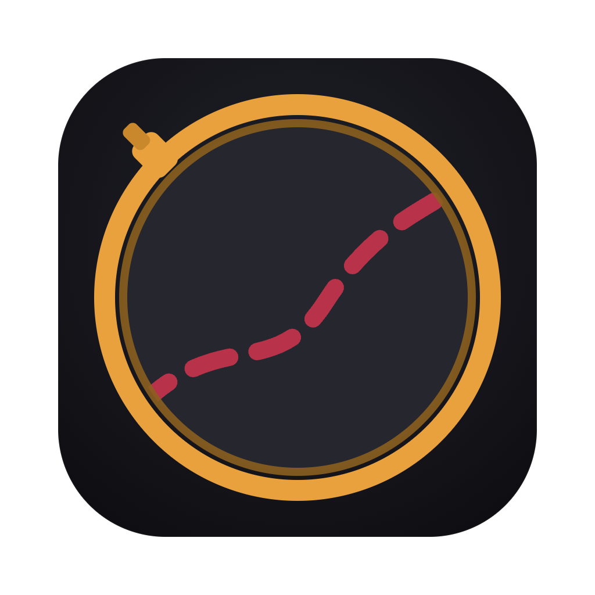
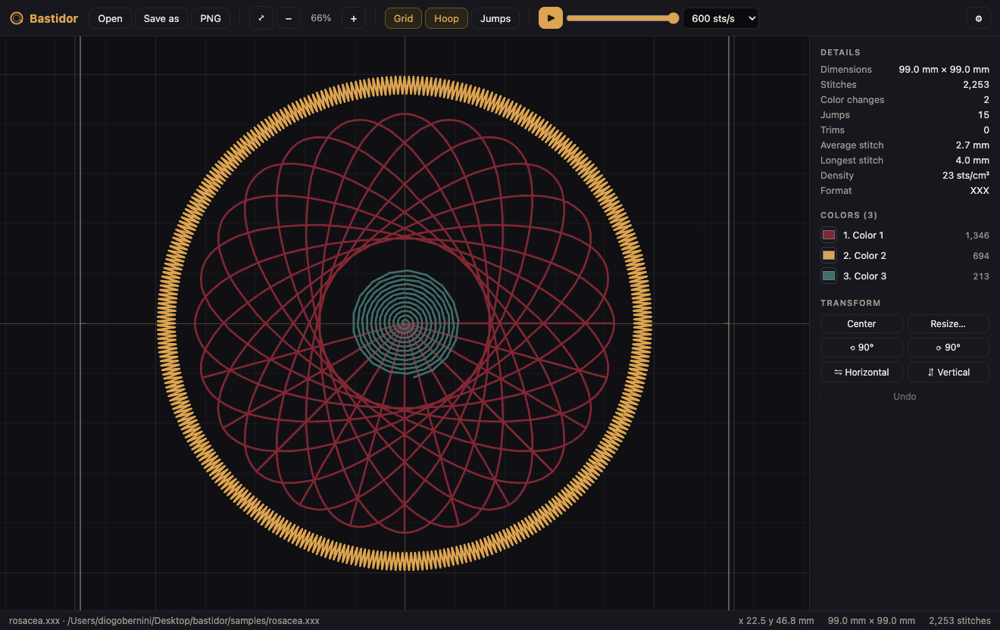
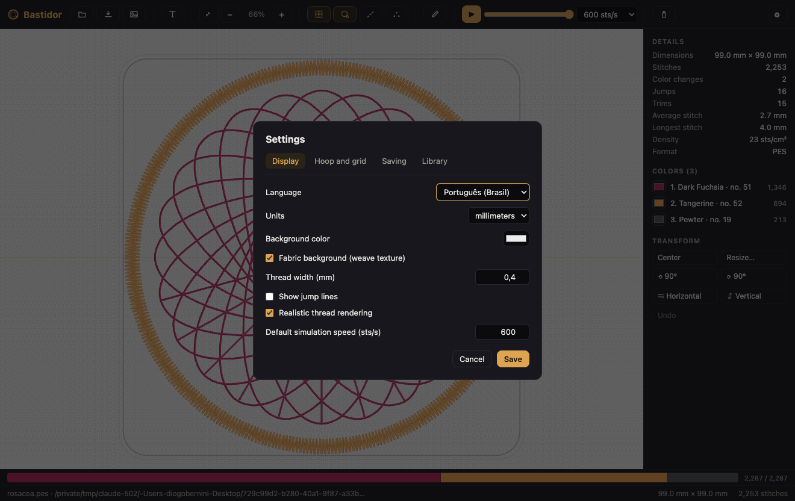
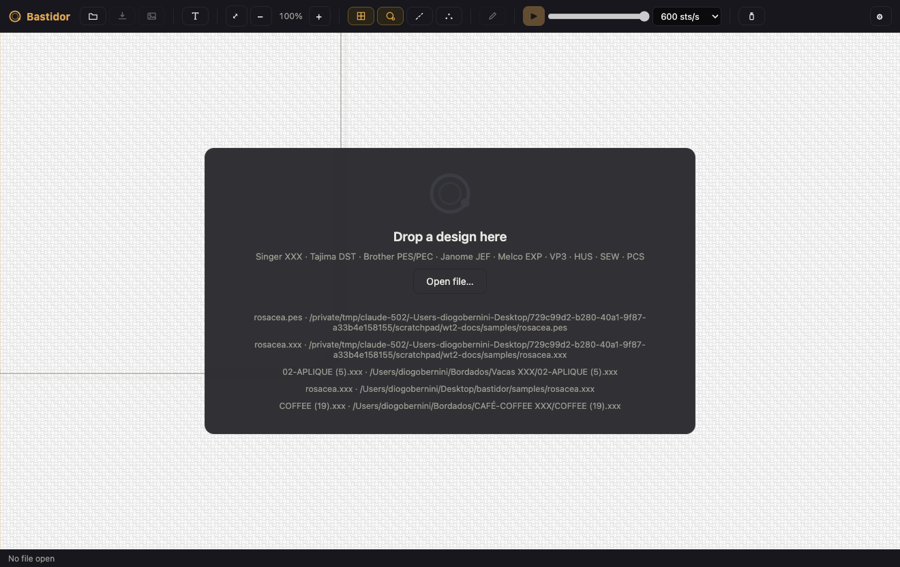

<p align="center">
  
</p>

<h1 align="center">Bastidor</h1>

<p align="center">
  An open source embroidery studio for Windows and macOS: view, convert, simulate and
  adjust embroidery designs. Built around <strong>Singer XXX</strong>, with DST, PES, PEC, JEF and EXP support.
</p>

<p align="center">
  <a href="README.pt-BR.md">Leia em português 🇧🇷</a>
</p>

<p align="center">
  
</p>

## Why

Commercial embroidery software is expensive, dongle-locked or stuck in the past.
Bastidor is an open, lightweight and modern alternative for everyday design work:
open, inspect, convert between formats, simulate the needle path and apply the right
machine adjustments when saving.

The app is bilingual (English and Brazilian Portuguese) and follows your system language.

## Features

- **Canvas viewer** with zoom, pan, millimeter grid and configurable hoop
- **Stitch-by-stitch simulator**: plays back the needle path with adjustable speed and a scrubber
- **Design details**: dimensions, stitches, color changes, jumps, trims, average/longest stitch and density
- **Per-block color editing** (colors are written to formats that store them, like XXX)
- **Transforms**: center, rotate 90°, mirror and resize, with undo
- **Format conversion** with saving adjustments:
  - automatic splitting of long stitches, always respecting each format's limit
  - configurable maximum stitch length (tightens beyond the format limit)
  - automatic lock stitches (tie-on and tie-off)
  - trim after N consecutive jumps (DST)
- **SVG and PNG export** for client approval
- **Warnings**: stitches too long and designs larger than the hoop
- Drag and drop, recent files, keyboard shortcuts

## Formats

| Format | Machines | Read | Write |
|---|---|:---:|:---:|
| XXX | Singer Futura / Compucon | ✓ | ✓ |
| DST | Tajima and most industrial machines | ✓ | ✓ |
| EXP | Melco / Bernina | ✓ | ✓ |
| PES / PEC | Brother / Babylock | ✓ | · |
| JEF | Janome / Elna | ✓ | · |
| SVG / PNG | vector and image | · | ✓ |

The parsers are cross-validated against [pystitch](https://github.com/inkstitch/pystitch):
files written by Bastidor are read back by the reference library with identical geometry
and colors, and vice versa (see `tests/`).

## More screens

| Settings (saving adjustments, hoop, grid) | Welcome |
|---|---|
|  |  |

## Running

Requires [Node.js](https://nodejs.org) 18 or newer.

```bash
npm install
npm start
```

Sample designs live in `samples/` (the rosette from this page, in every format).

```bash
npm test         # format round-trip test suite
npm run samples  # regenerates the sample designs
```

## Packaging (installers)

```bash
npm run dist:mac   # .dmg and .zip
npm run dist:win   # NSIS installer and portable
npm run dist       # both
```

Installers land in `dist/` with file associations (.xxx, .dst, .pes, .pec, .jef, .exp).

## Architecture

```
src/
  core/            # pure Node core, no Electron (testable in isolation)
    pattern.js     # design model (stitches, threads, transforms)
    encoder.js     # save-time normalizer (long stitches, lock stitches, trims)
    palettes.js    # factory thread charts: Brother (PEC) and Janome (JEF)
    io/            # one module per format + central registry
  main/            # Electron main process (window, menu, IPC, preferences)
  renderer/        # UI (canvas, simulator, panels)
  i18n.js          # English / Portuguese strings
```

Internal unit: 0.1 mm (the industry standard). The `core` has no Electron
dependency, so the parsers can be reused in a CLI or server.

## Roadmap

1. Digitizing: import SVG vector files as stitches
2. Digitizing: PNG to vector tool (posterize by color count, with preview)
3. Lettering tool: type text as embroidery (single-line fonts, satin, TTF fill)
4. Individual stitch editing (move, delete, insert)
5. Density recalculation when resizing
6. Realistic thread rendering (thread texture)
7. PES and JEF writing; VP3, HUS, SEW and PCS support
8. USB drive manager: library-style load and unload of designs, with safe eject and macOS hidden-file cleanup

## Credits and thanks

The heart of this project, the knowledge of binary embroidery formats, exists thanks
to the generous open source work of others:

- **[pystitch](https://github.com/inkstitch/pystitch)**, maintained by the
  **[Ink/Stitch](https://inkstitch.org)** team: the reference library the Bastidor
  parsers were ported from (to JavaScript), and validated against.
- **[pyembroidery](https://github.com/EmbroidePy/pyembroidery)**, by **Tatarize**
  and contributors (EmbroidePy): the original project that documented and implemented
  these formats, and the foundation of pystitch.

Thank you! The original MIT license is preserved in
[`LICENSES/pystitch-LICENSE.txt`](LICENSES/pystitch-LICENSE.txt).

## License

[MIT](LICENSE) © Diogo Bernini
