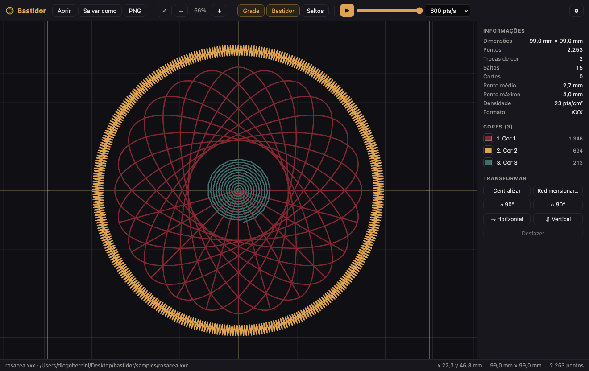
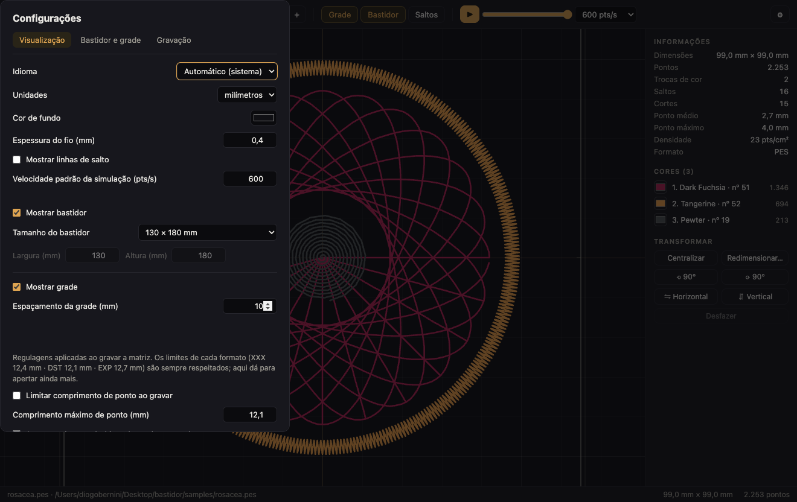
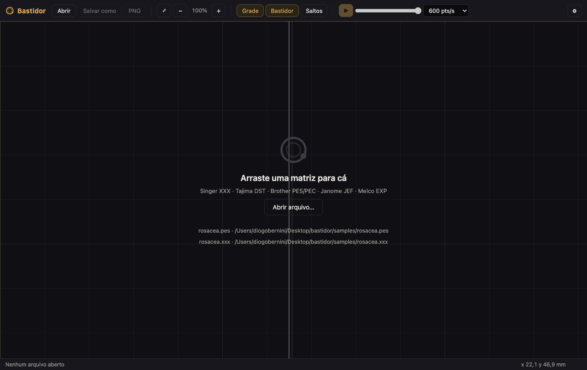

<p align="center">
  
</p>

<h1 align="center">Bastidor</h1>

<p align="center">
  Estúdio de bordado open source para Windows e macOS: visualize, converta, simule e ajuste
  matrizes de bordado. Foco em <strong>Singer XXX</strong>, com suporte a DST, PES, PEC, JEF e EXP.
</p>

<p align="center">
  <a href="README.md">Read in English 🇺🇸</a>
</p>

<p align="center">
  
</p>

## Por quê

Os softwares de bordado do mercado são caros, presos a dongles ou pararam no tempo.
O Bastidor é uma alternativa aberta, leve e moderna para o dia a dia de quem trabalha
com matrizes: abrir, conferir, converter entre formatos, simular o caminho da agulha
e aplicar as regulagens certas na hora de gravar.

O app é bilíngue (português do Brasil e inglês) e acompanha o idioma do sistema.

## Recursos

- **Visualização em canvas** com zoom, pan, grade em mm e bastidor configurável
- **Simulador de bordado**: reproduz o caminho da agulha ponto a ponto, com velocidade ajustável e barra de progresso
- **Informações da matriz**: dimensões, pontos, trocas de cor, saltos, cortes, ponto médio/máximo e densidade
- **Edição de cores** por bloco (as cores são gravadas nos formatos que as suportam, como o XXX)
- **Transformações**: centralizar, girar 90°, espelhar e redimensionar, com desfazer
- **Conversão entre formatos** com regulagens de gravação:
  - divisão automática de pontos longos respeitando o limite de cada formato
  - limite de comprimento de ponto configurável (aperta além do limite do formato)
  - arremates automáticos (tie-on e tie-off)
  - corte após N saltos seguidos (DST)
- **Exportação SVG e PNG** para aprovação de cliente
- **Avisos**: pontos longos demais e matriz maior que o bastidor
- Arrastar e soltar, arquivos recentes, atalhos de teclado

## Formatos

| Formato | Máquinas | Leitura | Gravação |
|---|---|:---:|:---:|
| XXX | Singer Futura / Compucon | ✓ | ✓ |
| DST | Tajima e a maioria das industriais | ✓ | ✓ |
| EXP | Melco / Bernina | ✓ | ✓ |
| PES / PEC | Brother / Babylock | ✓ | · |
| JEF | Janome / Elna | ✓ | · |
| SVG / PNG | vetor e imagem | · | ✓ |

Os parsers são validados de forma cruzada contra o [pystitch](https://github.com/inkstitch/pystitch):
os arquivos gravados pelo Bastidor são lidos pela biblioteca de referência com geometria
e cores idênticas, e vice-versa (suíte em `tests/`).

## Mais telas

| Configurações (regulagens de gravação, bastidor, grade) | Tela inicial |
|---|---|
|  |  |

## Rodando

Requisitos: [Node.js](https://nodejs.org) 18 ou superior.

```bash
npm install
npm start
```

Há matrizes de exemplo em `samples/` (a rosácea desta página, em todos os formatos).

```bash
npm test         # suíte de ida-e-volta dos formatos
npm run samples  # regenera as matrizes de exemplo
```

## Empacotando (instaladores)

```bash
npm run dist:mac   # .dmg e .zip
npm run dist:win   # instalador NSIS e portátil
npm run dist       # ambos
```

Os instaladores saem em `dist/` com associação de arquivos (.xxx, .dst, .pes, .pec, .jef, .exp).

## Arquitetura

```
src/
  core/            # núcleo puro Node, sem Electron (testável isoladamente)
    pattern.js     # modelo da matriz (pontos, fios, transformações)
    encoder.js     # normalizador de gravação (pontos longos, arremates, cortes)
    palettes.js    # paletas de fábrica Brother (PEC) e Janome (JEF)
    io/            # um módulo por formato + registro central
  main/            # processo principal do Electron (janela, menu, IPC, preferências)
  renderer/        # interface (canvas, simulador, painéis)
  i18n.js          # strings em português e inglês
```

Unidade interna: 0,1 mm (padrão da indústria). O `core` não depende do Electron,
então os parsers podem ser reaproveitados em CLI ou servidor.

## Roadmap

1. Digitalização: importar arquivo vetorial SVG como pontos
2. Digitalização: ferramenta de PNG para vetor (posterizar por quantidade de cores, com preview)
3. Edição de pontos individuais (mover, apagar, inserir)
4. Recalcular densidade ao redimensionar
5. Modo de visualização realista (textura de fio)
6. Gravação de PES e JEF; suporte a VP3, HUS, SEW e PCS

## Créditos e agradecimentos

O coração deste projeto, o conhecimento dos formatos binários de bordado, existe graças
ao trabalho generoso de código aberto de outras pessoas:

- **[pystitch](https://github.com/inkstitch/pystitch)**, mantido pela equipe do
  **[Ink/Stitch](https://inkstitch.org)**: a biblioteca de referência da qual os
  parsers do Bastidor foram portados para JavaScript, e contra a qual são validados.
- **[pyembroidery](https://github.com/EmbroidePy/pyembroidery)**, de **Tatarize**
  e colaboradores (EmbroidePy): o projeto original que documentou e implementou
  esses formatos, base do pystitch.

Muito obrigado! A licença MIT original está preservada em
[`LICENSES/pystitch-LICENSE.txt`](LICENSES/pystitch-LICENSE.txt).

## Licença

[MIT](LICENSE) © Diogo Bernini
